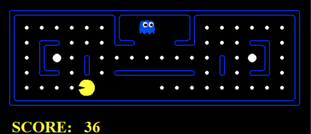

# 👻 Pacman: Search Algorithms

  

  

## 📌 Executive Summary
This repository contains the complete source code and algorithmic logic for an intelligent Pacman agent capable of autonomous pathfinding and real-time adversarial decision-making. The objective of this project is to demonstrate the rigorous application of theoretical computer science concepts—specifically graph traversal, state-space search, and game theory—within a dynamic grid environment.

The core focus of this project is the strict application of optimal and sub-optimal search strategies to balance mathematical perfection with computational efficiency.

## 🛠️ Core Engineering Practices
*   **Algorithmic Design:** Implemented classic Artificial Intelligence search algorithms including A*, Breadth-First Search (BFS), and Minimax with Alpha-Beta Pruning.
*   **State Space Optimization:** Utilized immutable data structures (`frozenset`) to hash complex multi-variable states (e.g., remaining food dots) for efficient explored-set memory management.
*   **Heuristic Engineering:** Designed custom heuristics using Minimum Spanning Trees (Prim's Algorithm) and exact maze distances to aggressively guide the search frontier.
*   **Performance Scaling:** Applied weighted heuristic multipliers and graph precomputation caching to drastically reduce node expansion in complex map layouts.

---

## 🚀 Algorithmic Evolution (Project Phases)

### 🔹 Phase 1: Single-Point Food Search (q1a)
*Established the foundational pathfinding mechanics to locate a single target on the map using optimal search criteria.*

*   **Objective:** Find the shortest path from Pacman's starting state to a single specific point (food dot) on the board.
*   **Relevant Algorithms:** A* Search Algorithm, Manhattan Distance Heuristic.
*   **Logic Flow:** 
    1. The problem initializes by extracting the start state and the target food location.
    2. A Priority Queue (`frontier`) is initialized, pushing the start state alongside a calculated path cost $g(n)$ of 0.
    3. The loop evaluates the lowest-cost node. If it is not the goal, it generates successors (valid adjacent grids without walls).
    4. For each successor, it calculates the evaluation function $f(n) = g(n) + h(n)$, where $h(n)$ is the Manhattan distance to the goal, and pushes it back into the frontier.
*   **Limitations:** Manhattan distance calculates grid steps blindly, completely ignoring maze walls. In complex layouts, it severely underestimates the true cost, causing the A* search to expand unnecessary nodes in dead ends.
*   **Solution (Assumption):** Assuming unlimited pre-processing time and memory, this limitation is solved by running a Breadth-First Search (BFS) at initialization to precompute the exact step distance from every grid to the goal, replacing the Manhattan heuristic entirely.

### 🔹 Phase 2: Multi-Point Routing & Optimization (q1b)
*Advanced the routing capabilities to handle the Traveling Salesperson Problem (TSP) equivalent of consuming all food dots scattered across the map.*

*   **Objective:** Navigate through the maze to efficiently collect an array of multiple food dots.
*   **Relevant Algorithms:** Weighted A* Search, Breadth-First Search (BFS), Prim's Algorithm (Minimum Spanning Tree).
*   **Logic Flow:**
    1. **Precomputation:** Before searching, a BFS computes and caches the exact distances between every food dot and every walkable grid.
    2. **State Representation:** The state tracks the current location and a `frozenset` of unconsumed food.
    3. **Successor Generation:** Instead of stepping one grid at a time, successors jump directly to the next targeted food dot, pulling the exact step cost and action path from the BFS cache.
    4. **Heuristic (MST):** Prim's Algorithm generates a Minimum Spanning Tree connecting all remaining unvisited food dots. The heuristic adds this MST cost to the distance of the closest food dot.
    5. **Weighted Evaluation:** The algorithm calculates $f(n) = g(n) + (2.5 \times h(n)) - (g(n) \times 0.0001)$ to evaluate the queue.
*   **Limitations:** The search algorithm applies a 2.5 multiplier to the MST heuristic ($$2.5 \times h(n)$$). This breaks the mathematical rule of admissibility (it overestimates the cost), meaning the search trades optimal perfection for processing speed.
*   **Solution (Assumption):** Assuming execution time complexity limits are removed, removing the 2.5 weight restores admissibility, guaranteeing the absolute mathematically shortest path at the cost of expanding significantly more nodes.

### 🔹 Phase 3: Adversarial Game Theory & Minimax (q2)
*Transitioned from static pathfinding to dynamic, real-time decision making against hostile entities (Ghosts).*

*   **Objective:** Maximize the game score while surviving active ghosts and consuming available resources.
*   **Relevant Algorithms:** Minimax Algorithm, Alpha-Beta Pruning, BFS.
*   **Logic Flow:**
    1. A BFS initialization maps the exact shortest paths across the entire grid to create an $O(1)$ perfect distance lookup table.
    2. The Minimax tree builds out to a fixed depth limit, simulating Pacman as the "Maximizer" (seeking highest score) and the ghosts as "Minimizers" (seeking lowest score).
    3. Alpha-Beta Pruning cuts off branches where the minimizer or maximizer is mathematically guaranteed a better outcome elsewhere, saving massive amounts of compute time.
    4. At the terminal depth, a custom Evaluation Function scores the state: it applies massive penalties for being within 1-2 steps of an active ghost, rewards proximity to scared ghosts, and rewards proximity to remaining food and capsules using the precomputed distance table.
*   **Limitations:** The agent operates on a strict, static search depth parameter. This creates a "Horizon Effect," where the agent cannot foresee a guaranteed game-over state (or massive reward) that occurs just one step past its maximum search depth.
*   **Solution (Assumption):** Assuming flexible, dynamic hardware clock times per turn, implementing Iterative Deepening Search would solve this. The system would start at depth 1, then 2, then 3, continually searching deeper until a strict time limit (e.g., 50ms) expires, maximizing the available foresight for that specific move.

---

## 👨‍💻 Author
Tay Chee Hsian
